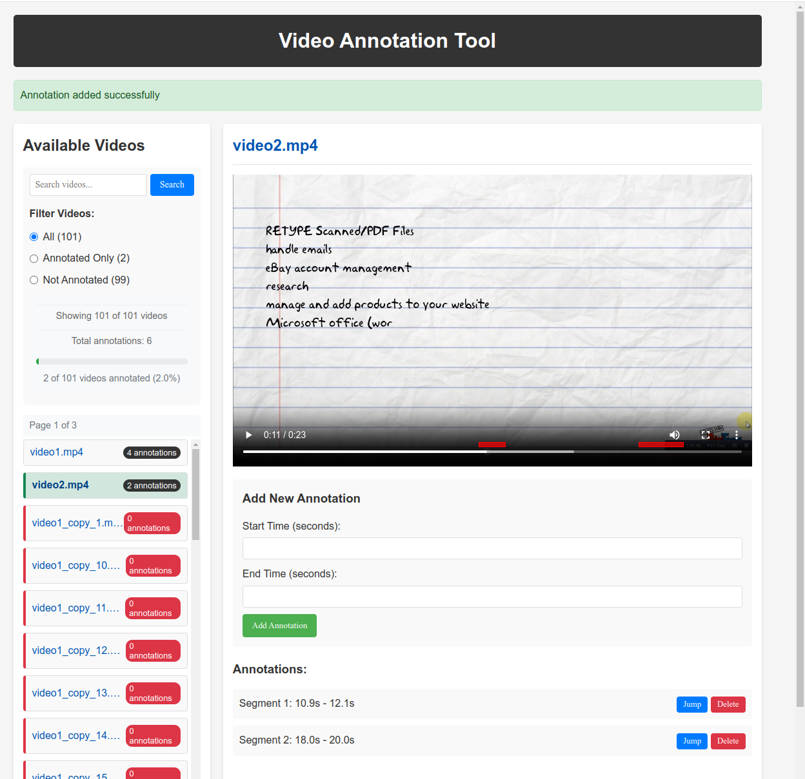

# Video Annotation Tool

A lightweight web application for annotating video files by marking segments with start and end times. 
Built with Python Flask and minimal JavaScript, the tool is designed to be simple and efficient.



## Features

- **Video Management**: View, search, and filter videos (supports MP4, AVI, MOV, MKV)
- **Annotation**: Mark segments of videos with start and end timestamps
- **Timeline Visualization**: Red markers show annotations directly on the video timeline
- **Filtering Options**: View all videos, only annotated videos, or only unannotated videos
- **Search**: Find videos by filename
- **Pagination**: Efficiently navigate large video collections (500+ videos)
- **Path Normalization**: Automatically handles path inconsistencies in annotation data

## Getting Started

### Prerequisites

- Python 3.6 or higher
- Flask 2.0.1 or higher
- Modern web browser (Chrome, Firefox, Safari, Edge)

### Installation

1. Clone the repository:
   ```bash
   git clone git@github.com:maulikmadhavi/video_annotation.git
   cd video-annotation-tool
   ```

2. Install dependencies:
   ```bash
   pip install -r requirements.txt
   ```

3. Add your videos:
   - Place your video files in the `/videos` directory
   - Supported formats: MP4, AVI, MOV, MKV

### Running the Application

Start the application with:

```bash
./run.sh
```

Or manually:

```bash
python backend/app.py
```

Access the tool in your browser at: [http://127.0.0.1:5000](http://127.0.0.1:5000)

## Usage Guide

### Video Navigation

- Browse videos in the left sidebar
- Use the search box to find specific videos
- Filter videos using the radio buttons:
  - **All**: Show all available videos
  - **Annotated Only**: Show only videos that have annotations
  - **Not Annotated**: Show only videos without annotations

### Creating Annotations

1. Select a video from the sidebar
2. Enter start time and end time in seconds
3. Click "Add Annotation"

### Managing Annotations

Each annotation has two actions:
- **Jump**: Move the video playhead to the annotation's start time
- **Delete**: Remove the annotation

### Timeline Markers

- Red markers on the video timeline represent annotations
- Click on a marker to jump to that annotation's start time
- Hover over markers to see the annotation details

### Path Issues

If the tool detects inconsistent file paths in your annotation data, a warning will appear with a "Fix Path Issues" button to automatically normalize paths.

## Data Storage

Annotation data is stored in:
